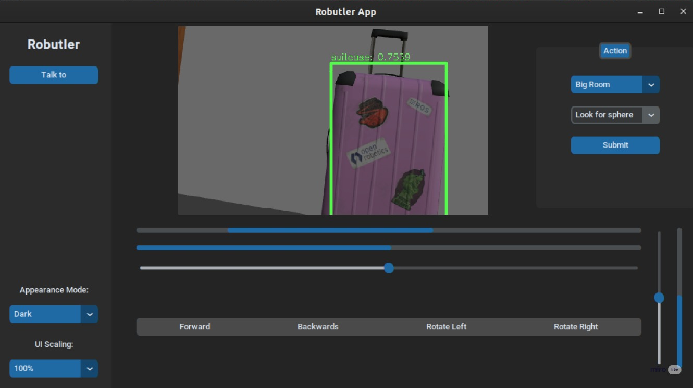

# robutler_psr_2022

This works was made in the ambit of the corse robotic systems programing. This will make use of ROS, and two well known robots, for the movement it will be used the turtelbot waffle pi. For manipulating the environment it wil be used the BCN3D MOVEO, a open sorce and 3D printable manipulator with 5 degrees of freedom. A link with more information is available here: <https://www.bcn3d.com/bcn3d-moveo-the-future-of-learning-robotic-arm/>

## Project description

The objective is to develop a robotic system that acts like a butler. To accomplish this the robot needs to be capable of preform a set o functionalities, such as:

1. Create a map of the enviroment in witch is inserted.
2. Move automatically tro the environment without colliding with it.
3. Have the capability to perform basic functions like
   1. See if some one is at home.
   2. Check if a item is present in a room of the house.
   3. Pick up objects. (Ex. trash)
4. Interact with the environment in a intelligent way.

## ROS moduls to acomplish the objective

In order to accomplish the objectives a set of ROS modules will need to be used.

### Simulation

For simulation it will be used Gazebo with a apartment Tip_Gripper_Idol_Jointklike world comprise of a set of rooms, and the appropriated furniture.

The floor plant can be seen in the image bellow:


*Apartment plant*

The gazebo simulation can be see here:


*Gazebo simulation*

### Mapping and Navigation

For the mapping and navigation it will be used the gmapping module and the move base module, respectively.

### Perception

For the perception it will be use a set of two sensors. A laser scan for obstacle detection and mapping and a RGB camera for object recognition.k

The RGB camera feed is passed to a script that makes use of the yolo library for the object recognition. The yolo weights file is not present in the repository since is a very large fille, however it can be downloaded.

### Manipulator

For the manipulator it will be use the moveit package. For the base it was used a already available version for the MOVEO robot that version can be found here:

[https://github.com/babakc/moveo_ros](https://github.com/babakc/moveo_ros)

### User Interface

To control the robot and send some basic commands we can use the created app using Tkinter. This interface can be seen bellow

*App interface*

## How to run the system

To lauch the gazebo simulation

```bash
roslaunch robutler_bringup gazebo.launch
```

To spawn the robot in the Gazebo world, and open the rviz

```bash
roslaunch robutler_bringup bringup.launch
```

After running this two commands it will be possible to see the following interfaces


*Rviz configuration exemple without the navigation stack*


*Close up on the robot model in Rviz*


*Exemple of the robot visual inside the simulated world*

This will launch the Moveit interface

```bash
roslaunch moveo_moveit_config demo.launch
```

Once this command is run the Moveit planing interface can be use to manipulate the robot position in the world.


*Example of a robot pose manipulation*

To launch the navigation stack is necessary to run the following command:

```bash
roslaunch robutler_navigation navigation.launch
```

After this the map will be available in Rviz, and the pose estimation and 2D goal can be used.

To launch the main program, responsible for the camera node, teleop control and semantic tasks, is necessary to run the command:

```python
python3 mainprog.py
```

however this command needs to be run in a specific directory, we can travell to this directory using the command

```bash
 cd /catkin_ws/src/robutler_psr_2022/robutler_interface
```

This location will change based on the computer


*Object recognition using YOLO*

### Ambient mapping

After running in a first instance the slam gmmaping the map bellow is obtained for the apartment


*Map created*

This map is accurate when compared with the original geometry of the apartment.

### Trasnforms tree

After all programs have been lauched the transformation tree should look something like the image bellow


*Transformation tree*

The communication between all the nodes can be seen here


*RQT graph view*

## Available missions

* Search for objects in a room
* Check for people presence
* Move to a division
* Pick a object and travel with it

## Future work

The main program should be launched using the roslaunch command, this will allow for a unchanged way to deploy the robot as well as the creation of a global launch file.

Another improvement for the future could be to make use of the perception pipeline of the Moveit pkg, this would allow to add a depth sensor to the system and dynamically, from the point cloud data, add obstacles that would be use to improve the arm planning.

The arm simulation has a problem in the displayed gripper. Because of this its impossible to grab objects in gazebo.
